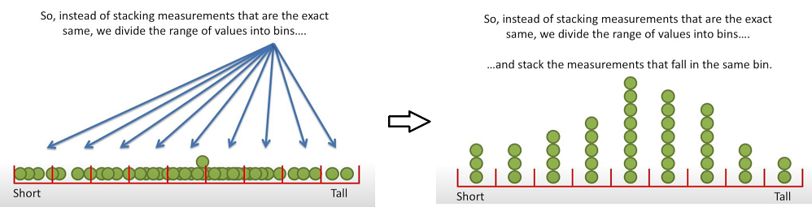
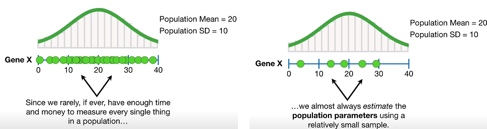
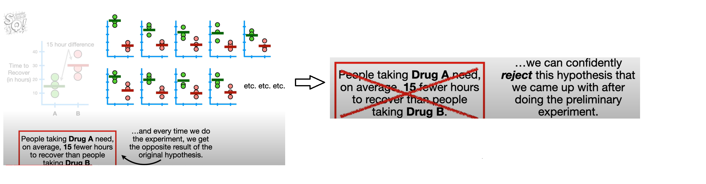

# Statistics Fundamentals

## The 8-20% you should know about Statistics.

#### Histograms

A histogram is a type of graph used to represent the distribution of a set of data

### Probability Distributions

The histogram and the curve are "distributions". They show us how the probabiliteis of measurements are distributed

#### Mean, median, mode, normal distribution, standard deviation

`Mean`: The average value of a dataset, calculated by adding up all the numbers an dividing by the count of numbers.  
`Median`: Middle value in a dataset.  
`Mode`: The most requently occurring value in a dataset.  
`Normal distribution`:A probability distribution that ia symmetric around the mean, showing that data near the mean are more frequent in occurrence than data far from the mean.  
`standard deviation`: How wide the curve is around the mean.  

#### Population and Estimated Parameters.

Since we rarely, if ever have enough time and money to measure every single thing in a population we almost always estimate the **population parameters** using a relatively small sample.  
The more data that we have, the more confidence we can have in the accuracy of the estimates. 

One of the main goals in statistics is quantifying how muchs confidence we can hae in pupulation estimates 
so we calculated **p-values** and **confidence intervals** to quantify the confidence in the estimates parameters.  

#### Hypothesis Testing and The null Hypothesis.

**Hypothesis Testing**: Try to determine if two things are the same or not.  
**Null Hypothesis**: The hypothesis that there is not difference between two things.

#### Alternative Hypothesis  

- Use only to reject or fail to reject the null or primary hypothesis.  
- Normally is just simply the oposite to the null Hypothesis. 

When we only have two gorups of data, the Alternative Hypothesis is super obious because its is just the opposit of the **Null Hypothesis**.  
When we have 3 or more groups we have options for the Alterntive Hypothesis and dependen of which one we use in the **Statistical Test** we can end up making a different decision about the Null.

#### Statistical Test Needs

1) Data.  
2) Null Hypothesis.  
3) Alternative Hypothesis.

#### p-values: What are and how to interpret them

There are a lot of weird, random things that can happend when doing a test... this means that we need to try the experiment on more than just one person each.
Imagine we are testing two drugs A, and B. We want to see if they are different.

**p-values** are numbers between **0** and **1**, that, in this example, quatify how confident we should be that **Drug A** is different from **Drug B**. The closer a p-values is to 0,
the more confidente we have that Drug A and Drug B are different (the more confident that the experiment is statistical relevant).  
In practice, a commonly used threshold is **0.05**. It means that if there is no difference between **Drug A** and **Drug B**, and if we did this exact same experiment a bunch of times,
then oly 5% of those experiments wold result in the wrong decision.

**p-values** helps us decide if we should reject the **Null Hypothesis** or not.

#### How to calculate p-values
